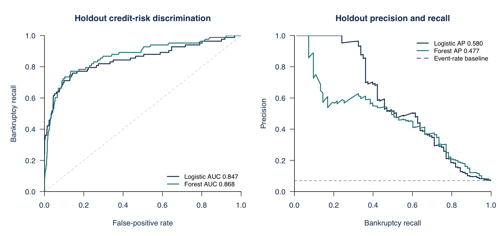
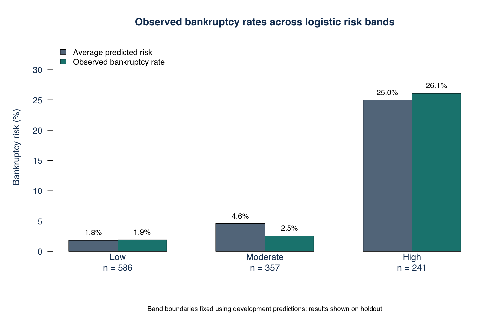
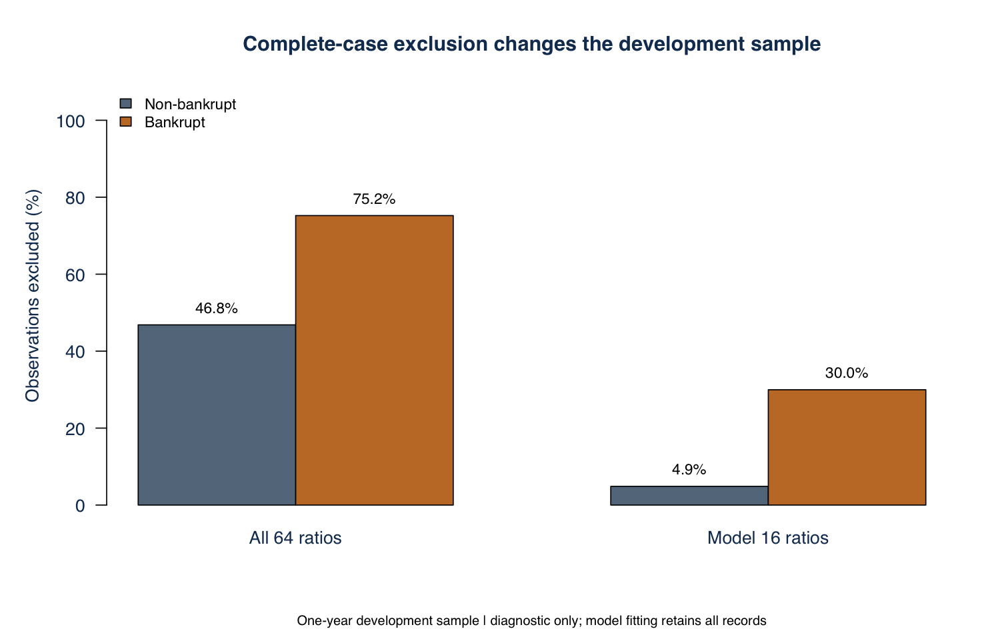

# Polish Companies Bankruptcy Analysis

Financial ratio analysis for bankruptcy screening, with repeated cross-validation, a separate holdout, risk segmentation and a calibrated random-forest challenger.

[Executive summary (PDF)](reports/Bankruptcy_Risk_Executive_Summary.pdf) · [Full report (PDF)](Final_Project_Report_Florien_Siakoua_Toukam.pdf) · [Methodology](docs/methodology-notes.md) · [Run the analysis](#run-the-analysis)

The one-year holdout supports both models for prioritizing financial review. Ridge logistic regression has ROC AUC 0.847; the balanced random forest has 0.868. The forest's higher AUC does not establish a clear overall advantage: the paired difference's 95% interval includes zero, while logistic regression has higher average precision and lower probability error. I would retain logistic regression as the interpretable reference model and use the forest as a challenger.

## One-year holdout results

| Metric | Ridge logistic | Balanced forest |
| --- | --- | --- |
| ROC AUC | 0.847 | 0.868 |
| Average precision | 0.580 | 0.477 |
| Bankruptcy recall | 75.9% | 77.1% |
| Specificity | 83.8% | 85.6% |
| Precision | 26.1% | 28.8% |
| Accuracy | 83.3% | 85.1% |

The holdout contains **1,184 records and 83 bankruptcies**. Mean development cross-validation AUCs are 0.864 and 0.877, respectively. The paired forest-minus-logistic holdout AUC difference is 0.021 (95% interval -0.013 to 0.054).



## Screening and risk bands

An assumed capacity to review 20% of development observations produces a 6.65% logistic screening threshold and a 9.35% forest threshold. Applied unchanged to 1,184 holdout records, logistic regression flags 241 records and identifies 63 of 83 bankruptcies. The forest flags 222 and identifies 64. These are initial review thresholds, not automatic credit decisions.

| Logistic band | Records | Mean predicted risk | Observed bankruptcy rate |
| --- | --- | --- | --- |
| Low | 586 | 1.8% | 1.9% |
| Moderate | 357 | 4.6% | 2.5% |
| High | 241 | 25.0% | 26.1% |

Band boundaries are 3.24% and 6.65%, determined from development scores. Actual holdout review shares are 20.4% and 18.8%; a fixed threshold does not force an exact holdout review percentage.



At the development-selected thresholds, the forest captures one additional bankruptcy with 20 fewer false positives. Across all score thresholds, logistic regression has higher average precision (0.580 versus 0.477). Its top decile captures 62.7% of holdout bankruptcies. The choice therefore depends on review capacity, the quality of risk ranking at the top of the list and interpretability.

## Financial interpretation

Higher sales growth, working capital relative to assets, company size, and profitability are associated with lower estimated bankruptcy odds in the regularized model. A higher liabilities-to-assets ratio is associated with higher odds. These directions are stable across the ten outer fits for the six ratios shown below. Coefficients are conditional on the other inputs; they do not identify causal effects.

| Ratio | Calibrated odds ratio per IQR |
| --- | --- |
| Sales growth ratio | 0.61 |
| Working capital / assets | 0.73 |
| Log total assets | 0.77 |
| Gross profit plus depreciation / sales | 0.81 |
| Net profit / assets | 0.84 |
| Liabilities / assets | 1.18 |

The [full driver table](outputs/tables/logistic-risk-drivers.csv) reports all 16 ratios, including small and less intuitive associations. [Ratio sensitivity](outputs/tables/financial-ratio-sensitivity.csv) measures isolated changes within development support; it is not an accounting-consistent stress test.

## Data quality and sample inclusion

The [UCI Polish Companies Bankruptcy data](https://doi.org/10.24432/C5F600) contain five separate forecasting samples. **5year.arff is the one-year-ahead sample; 1year.arff is the five-year-ahead sample.** The five source files are included unchanged under CC BY 4.0 with [attribution and checksums](docs/data-source.md). Each has 64 predictors plus the bankruptcy indicator.

Requiring complete values in the 16 model ratios would exclude 98 of 327 bankrupt development records (30.0%), compared with 214 of 4,399 non-bankrupt records (4.9%). Training-only median imputation and missing indicators retain every record.



Bankruptcy prevalence is 6.9% in the one-year sample, making accuracy alone insufficient. [Sample-selection diagnostics](outputs/tables/complete-case-selection-diagnostic.csv) cover all five horizons. The [development correlation matrix](outputs/figures/development-ratio-correlations.png) and [VIF table](outputs/tables/development-collinearity-diagnostics.csv) describe dependence among the model ratios without selecting features from holdout outcomes.

## Validation design

1. Group identical raw predictor rows and reserve approximately 20% of groups for holdout evaluation.
2. Use two repeats of grouped five-fold cross-validation in development, with a nested three-fold calibration step.
3. Estimate median imputation, missing indicators and 1st/99th percentile clipping inside each training sample.
4. Fit ridge logistic regression and a balanced 500-tree random forest using the same 16 finance-defined ratios.
5. Set separate calibrated screening thresholds from a 20% development review budget; define logistic risk bands from development scores.
6. Evaluate the fixed rules on holdout, including ROC AUC, average precision, calibration, confusion counts, lift and paired group-bootstrap uncertainty.

The fixed ridge penalty is 0.01; no hyperparameter or threshold selection uses holdout outcomes. The five horizons are analyzed separately, not pooled. Full details are in [methodology notes](docs/methodology-notes.md).

## Results and reports

- [One-page executive summary](reports/underwriting-summary.md)
- [Complete analysis report](reports/analysis-report.md)
- [Complete PDF report](Final_Project_Report_Florien_Siakoua_Toukam.pdf)
- [Downloadable self-contained HTML report](reports/analysis-report.html) — download and open locally; GitHub does not render HTML reports inline.
- [Holdout results by horizon](outputs/tables/horizon-holdout-performance.csv)
- [Cross-validation fold results](outputs/tables/cross-validation-fold-results.csv)
- [Development capacity analysis](outputs/tables/development-capacity-analysis.csv)
- [Illustrative cost sensitivity](outputs/tables/development-illustrative-cost-sensitivity.csv)
- [Holdout confidence intervals](outputs/tables/holdout-metric-confidence-intervals.csv)
- [All figures](outputs/figures/) and [all tables](outputs/tables/)

## Limitations and further work

These are historical, selected Polish company records, not a current credit book. Firm identifiers, observation dates, sector classifications, exposures and recovery outcomes are absent. Exact duplicate grouping reduces a known leakage risk, but cannot eliminate unidentified repeated-company dependence. The holdout is random rather than calendar-time based. Calibration is relative to the dataset's event mix, not a validated current-market probability of default.

The 16-ratio specification and fixed regularization are intentionally limited; broader feature or tuning searches have not been evaluated. Bootstrap intervals are conditional on the fitted models and split. Risk bands are cohort-relative, and cost weights are illustrative. Multi-horizon differences also reflect differing samples.

The next substantive steps are dated external validation, firm-level grouping, measured review and loss costs, drift monitoring and accounting-consistent financial scenarios. Further model complexity should be justified by those tests.

## Run the analysis

Use R 4.5.2 and open the RStudio project or start a terminal in this folder. Restore the package versions recorded in [renv.lock](renv.lock):

```r
install.packages("renv", repos = "https://cloud.r-project.org")
renv::restore(lockfile = "renv.lock", library = ".cache/R-library", prompt = FALSE)
.libPaths(c(".cache/R-library", .libPaths()))
```

```sh
R_LIBS_USER=.cache/R-library Rscript final_project.R
R_LIBS_USER=.cache/R-library Rscript tests/verify_results.R
```

The terminal commands above use macOS/Linux syntax. In RStudio or on Windows, run the R setup above, then `source("final_project.R")` and `source("tests/verify_results.R")`. The lockfile records R and package versions; it does not install R or system compilers. If an archived package has no compatible binary, source installation requires the platform's R build tools, including a Fortran compiler for glmnet. The local package library is excluded from version control through `.cache/`.

This regenerates all analytical CSVs and PNGs, including their folders if absent. All required data are included, and no external local files or saved model cache are required. The tested R and package versions are recorded in [software versions](outputs/tables/software-versions.csv) and [session information](docs/session-info.txt). Numerical fitting checks stop the analysis if convergence fails. Both macOS Quartz and Cairo-capable PNG rendering are supported.

To rebuild the written reports after a successful analysis:

```sh
python3 -m pip install -r requirements.txt
python3 scripts/build_reports.py
```

To regenerate PDFs as well, install LibreOffice and make its `soffice` command available, then run `python3 scripts/build_reports.py --pdf`. Otherwise open the generated Word files and export them to PDF. Word files are local editing copies excluded from version control; the repository includes the PDFs. Run `python3 tests/verify_package.py` after rebuilding. The HTML report embeds its figures and does not need an internet connection to display the analysis.

## Structure

```text
final_project.R
polish-companies-bankruptcy-analysis.Rproj
R/
  00_functions.R
  01_data_preparation_and_diagnostics.R
  02_model_validation.R
  03_visual_summaries.R
polish+companies+bankruptcy+data/     # Five unchanged ARFF files
docs/                              # Data source, checksums, methods, R session
outputs/figures/                    # PNG visual summaries
outputs/tables/                     # Results, predictions and diagnostics
reports/                           # Markdown, HTML and executive summary
scripts/build_reports.py
tests/verify_results.R
tests/verify_package.py
requirements.txt
renv.lock
Final_Project_Report_Florien_Siakoua_Toukam.pdf
```

## Sources

Tomczak, S. (2016). *Polish Companies Bankruptcy*. UCI Machine Learning Repository. [DOI 10.24432/C5F600](https://doi.org/10.24432/C5F600). Data: [CC BY 4.0](https://creativecommons.org/licenses/by/4.0/).

Methods and implementation: [glmnet](https://glmnet.stanford.edu/articles/glmnet.html), [randomForest](https://search.r-project.org/CRAN/refmans/randomForest/html/randomForest.html), and [pROC](https://xrobin.github.io/pROC/).
