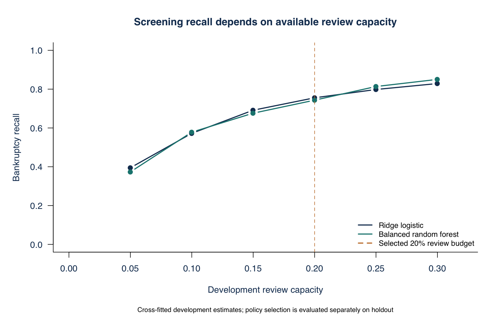

# Predicting Financial Distress in Polish Companies

Florien Siakoua Toukam

## Credit risk assessment

The one-year holdout supports both models for prioritizing financial review. Ridge logistic regression has ROC AUC 0.847; the balanced random forest has 0.868. The forest's higher AUC does not establish a clear overall advantage: the paired difference's 95% interval includes zero, while logistic regression has higher average precision and lower probability error. I would retain logistic regression as the interpretable reference model and use the forest as a challenger.

An assumed capacity to review 20% of development observations produces a 6.65% logistic screening threshold and a 9.35% forest threshold. Applied unchanged to 1,184 holdout records, logistic regression flags 241 records and identifies 63 of 83 bankruptcies. The forest flags 222 and identifies 64. These are initial review thresholds, not automatic credit decisions.

| Primary holdout | Ridge logistic | Balanced forest |
| --- | --- | --- |
| ROC AUC | 0.847 | 0.868 |
| Average precision | 0.580 | 0.477 |
| Bankruptcy recall | 75.9% | 77.1% |
| Precision | 26.1% | 28.8% |

Development-defined logistic bands produce observed holdout bankruptcy rates of 1.9%, 2.5% and 26.1% for Low, Moderate and High risk. The High band contains 241 records and 63 observed bankruptcies.

The analysis examines data quality and financial ratios, then evaluates two models under a shared development-and-holdout design. The objective is to prioritize records for financial investigation while making the review workload and missed cases explicit.

## Data and forecasting horizons

The data come from Sebastian Tomczak's Polish Companies Bankruptcy dataset, published by the UCI Machine Learning Repository. Each record contains 64 financial predictors and a bankruptcy indicator. All five supplied ARFF files are retained unchanged; their SHA-256 checksums identify the exact inputs.

| File | Horizon | Records | Bankruptcies | Event rate |
| --- | --- | --- | --- | --- |
| 1year.arff | 5 years | 7,027 | 271 | 3.9% |
| 2year.arff | 4 years | 10,173 | 400 | 3.9% |
| 3year.arff | 3 years | 10,503 | 495 | 4.7% |
| 4year.arff | 2 years | 9,792 | 515 | 5.3% |
| 5year.arff | 1 year | 5,910 | 410 | 6.9% |

The filename is not the remaining prediction horizon: 1year.arff refers to the first forecasting-period year and labels bankruptcy after five years. The primary one-year-ahead sample is 5year.arff. Each file is modeled separately; the analysis does not pool them or assume they contain distinct firms.

The primary split contains 4,726 development records with 327 bankruptcies and 1,184 holdout records with 83 bankruptcies. Its 60 excess exact predictor matches are retained but assigned to the same split as their matching records.

Missing values are handled inside each training sample. Median imputation and missing-value indicators preserve incomplete observations; training-percentile clipping limits the influence of extreme ratio values. The raw files are never rewritten.

## Data quality and sample inclusion

Requiring complete values in the 16 model ratios would exclude 98 of 327 bankrupt development records (30.0%), compared with 214 of 4,399 non-bankrupt records (4.9%). Training-only median imputation and missing indicators retain every record.

One-year development records excluded by complete-case requirements. No records are excluded from model fitting.

Bankruptcies account for 6.9% of the one-year sample. Labeling every record non-bankrupt would achieve 93.1% accuracy but zero bankruptcy recall. Evaluation therefore includes precision-recall performance, screening capture and false-positive review volume alongside ROC AUC.

After development-only imputation and clipping, variance inflation factors across the 16 ratios range from 1.08 to 6.17. The development correlation matrix and VIF table document predictor dependence. Ridge regularization stabilizes fitting; the coefficients still describe associations conditional on the other ratios, not independent causal effects.

## Model development and validation

The comparison uses the same 16 finance-defined ratios for both models. Inputs cover profitability, leverage, liquidity, capital accumulation, sales growth, size and working-capital efficiency. The set is fixed before evaluation, without outcome-based feature selection.

Exact matches across all 64 raw predictors form groups. Approximately 20% of groups within each outcome stratum are reserved for holdout evaluation. Development uses two repeats of grouped five-fold cross-validation. No matching predictor group crosses a training/validation or development/holdout boundary.

Every fit estimates medians and 1st/99th percentile clipping limits on its own training observations. Each of the 16 ratios also receives a missing indicator. Ridge logistic regression standardizes inputs and uses a fixed penalty of 0.01. The random forest uses 500 trees, five candidate variables at each split, minimum terminal-node size five, and equal bootstrap counts from each outcome class.

Each outer training fold runs a separate three-fold procedure to obtain calibration scores. Platt calibration is fitted to those inner out-of-fold scores at the natural event prevalence, then applied to the outer validation predictions. This keeps calibration separate from validation outcomes. The two outer validation scores per development record are averaged for screening-policy and risk-band design.

Final calibrators use development out-of-fold scores. Final base models use all development records. Their fitted transformations, calibrators, screening thresholds and risk-band boundaries are fixed before evaluating the holdout. The forest's balanced vote fraction is not treated as an unadjusted probability.

Model specifications are fixed rather than chosen by a large tuning search. Base seed 5442026, the file-specific seed schedule and package versions are recorded. The 95% holdout intervals use 500 paired, outcome-stratified bootstrap samples of predictor groups. They are conditional on the fitted models and the chosen split.

## One year holdout performance

| Metric | Ridge logistic | Balanced forest |
| --- | --- | --- |
| ROC AUC | 0.847 | 0.868 |
| Average precision | 0.580 | 0.477 |
| Bankruptcy recall | 75.9% | 77.1% |
| Specificity | 83.8% | 85.6% |
| Precision | 26.1% | 28.8% |
| Accuracy | 83.3% | 85.1% |
| Balanced accuracy | 79.9% | 81.4% |
| F1 | 0.389 | 0.420 |
| Brier score | 0.0433 | 0.0480 |
| Review share | 20.4% | 18.8% |
| True positives | 63 | 64 |
| False positives | 178 | 158 |
| False negatives | 20 | 19 |
| True negatives | 923 | 943 |

At the development-selected thresholds, the forest captures one additional bankruptcy with 20 fewer false positives. Across all score thresholds, logistic regression has higher average precision (0.580 versus 0.477). Its top decile captures 62.7% of holdout bankruptcies. The choice therefore depends on review capacity, the quality of risk ranking at the top of the list and interpretability.

The forest-minus-logistic AUC difference is 0.021, with a 95% interval from -0.013 to 0.054. Mean outer-fold AUCs are 0.864 for logistic regression and 0.877 for the forest. Cross-validation supports the forest's modest discrimination advantage, but does not establish superiority on every metric.

## Risk ranking and calibration

One-year holdout curves. Average precision uses the step precision-recall definition, not trapezoidal PR AUC.

The holdout bankruptcy prevalence is 7.0%. The highest-scoring logistic decile contains 119 records, captures 62.7% of bankruptcies, and achieves 6.23 times the full-sample event rate. Top-decile and top-quintile diagnostics use holdout rank, whereas the screening policy uses fixed development thresholds.

| Probability error | Ridge logistic | Balanced forest |
| --- | --- | --- |
| Raw Brier score | 0.0432 | 0.1077 |
| Calibrated Brier score | 0.0433 | 0.0480 |
| Development-prevalence baseline | 0.0652 | 0.0652 |

Calibration substantially reduces the forest's probability error. It slightly increases logistic Brier error on this holdout, so it is not described as a universal improvement. Calibration-bin plots are included with the supporting figures. A lower Brier score is better; the constant baseline uses development prevalence rather than learning the holdout event rate.

## Screening policy and risk segmentation

An assumed capacity to review 20% of development observations produces a 6.65% logistic screening threshold and a 9.35% forest threshold. Applied unchanged to 1,184 holdout records, logistic regression flags 241 records and identifies 63 of 83 bankruptcies. The forest flags 222 and identifies 64. These are initial review thresholds, not automatic credit decisions.

| Logistic band | Records | Average score | Observed rate |
| --- | --- | --- | --- |
| Low | 586 | 1.8% | 1.9% |
| Moderate | 357 | 4.6% | 2.5% |
| High | 241 | 25.0% | 26.1% |

The Low-to-Moderate boundary is 3.24% and the Moderate-to-High boundary is 6.65%. They correspond approximately to the median and 80th percentile of cross-fitted development scores. High is a relative screening band, not a regulatory grade or an independently validated rating.

Development policy sensitivity. The vertical line marks the assumed 20% review budget, not a 20% probability threshold.

The cost-sensitivity table tests missed-bankruptcy weights of 5, 10 and 20 false-positive units. These illustrative weights are not currency estimates. They expose the sensitivity of a decision rule to business priorities without replacing the capacity-based primary policy.

## Financial drivers and model sensitivity

Higher sales growth, working capital relative to assets, company size, and profitability are associated with lower estimated bankruptcy odds in the regularized model. A higher liabilities-to-assets ratio is associated with higher odds. These directions are stable across the ten outer fits for the six ratios shown below. Coefficients are conditional on the other inputs; they do not identify causal effects.

| Ratio | Odds ratio per IQR | Positive in CV fits |
| --- | --- | --- |
| Sales growth ratio | 0.61 | 0% |
| Working capital / assets | 0.73 | 0% |
| Log total assets | 0.77 | 0% |
| Gross profit plus depreciation / sales | 0.81 | 0% |
| Net profit / assets | 0.84 | 0% |
| Liabilities / assets | 1.18 | 100% |

Odds ratios use an interquartile increase in the transformed development ratio and include the final calibration slope. Ridge shrinkage addresses numerical instability from correlated inputs, but does not make each coefficient an independent economic mechanism. The full table includes weak or counterintuitive conditional associations rather than suppressing them.

| Half IQR ratio increase | Logistic change pp | Forest change pp |
| --- | --- | --- |
| Net profit / assets | -0.35 | -0.30 |
| Liabilities / assets | 0.36 | 0.02 |
| Current assets / short-term liabilities | 0.03 | -1.31 |
| Sales growth ratio | -0.98 | -0.84 |

The table reports percentage-point changes in average holdout scores after increasing one ratio by half its development interquartile range. Logistic regression models log odds as linear in the transformed inputs, while the forest can capture nonlinear relationships. The supporting sensitivity table and figure also document the model response; decreases are included in the CSV.

These one-at-a-time perturbations are bounded by development support. They do not maintain all accounting identities and cannot be interpreted as a balance-sheet stress test or the causal impact of changing a firm's finances. A coherent stress framework would require underlying statements and scenario assumptions.

## Horizon comparison and practical use

| Horizon | Logistic AUC | Forest AUC | Logistic recall | Forest recall |
| --- | --- | --- | --- | --- |
| 1 year | 0.847 | 0.868 | 75.9% | 77.1% |
| 2 years | 0.786 | 0.800 | 63.5% | 65.4% |
| 3 years | 0.742 | 0.745 | 42.4% | 48.5% |
| 4 years | 0.658 | 0.696 | 30.0% | 38.8% |
| 5 years | 0.682 | 0.731 | 48.1% | 55.6% |

The strongest discrimination is in the one-year sample. Longer-horizon performance is weaker and varies across files. Because their company coverage and event mix differ, these results do not isolate the causal effect of time to bankruptcy. Recall is evaluated at a separate development-selected threshold for each file and model.

These are historical, selected Polish company records, not a current credit book. Firm identifiers, observation dates, sector classifications, exposures and recovery outcomes are absent. Exact duplicate grouping reduces a known leakage risk, but cannot eliminate unidentified repeated-company dependence. The holdout is random rather than calendar-time based. Calibration is relative to the dataset's event mix, not a validated current-market probability of default.

I would use the scores to prioritize financial review, then examine liquidity, refinancing needs, earnings quality, collateral and recent developments. A current lending application would first require a dated external cohort, firm-level identifiers, review-cost information and monitoring of calibration and data drift. Further research should test temporal transportability and coherent statement-based stress scenarios rather than add complexity solely to raise a benchmark score.

## Execution and supporting materials

The project contains the five UCI datasets, the executable R entry point, shared functions, data diagnostics, model validation, figures, output tables, methodology notes, this report and a one-page executive summary. The self-contained HTML report embeds its figures and can be opened directly in a browser.

From the project directory, run Rscript final_project.R, then Rscript tests/verify_results.R. Run python3 scripts/build_reports.py to regenerate the Markdown, HTML and editable Word documents from the executed tables. The --pdf option uses LibreOffice to regenerate the PDFs. Exact software versions are recorded in outputs/tables/software-versions.csv and docs/session-info.txt.

The included datasets and relative file paths make the project self-contained. The R pipeline creates its output folders and execution cache when needed. Screening conclusions use independently evaluated holdout predictions. No financial losses, market returns or real credit decisions are inferred from the bankruptcy labels.

Sources

Tomczak, S. (2016). Polish Companies Bankruptcy. UCI Machine Learning Repository. https://doi.org/10.24432/C5F600. Data licensed under CC BY 4.0.

UCI data description and financial definitions: https://archive.ics.uci.edu/dataset/365/polish+companies+bankruptcy+data

glmnet documentation: https://glmnet.stanford.edu/articles/glmnet.html

randomForest documentation: https://search.r-project.org/CRAN/refmans/randomForest/html/randomForest.html
